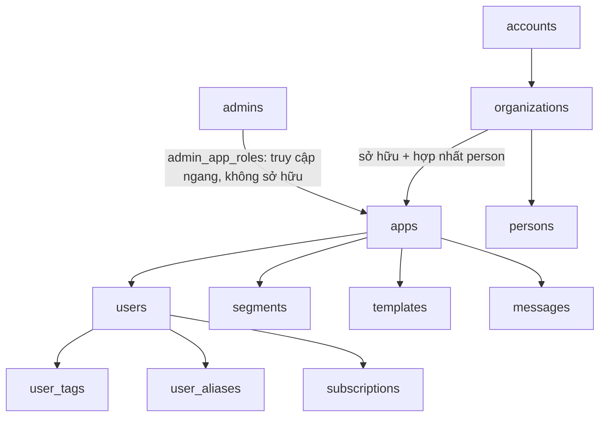
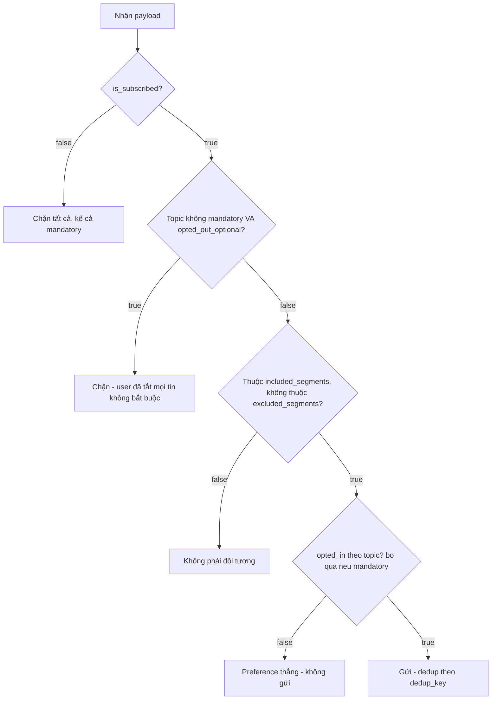

# Notification Service — Thiết kế hợp nhất

2026-09-17 · @Someone

## Nguyên tắc nền tảng & mô hình phân cấp

Năm nguyên tắc định danh áp dụng nhất quán cho mọi bảng:

- **Định danh = UUID** (duy nhất toàn cục); **tên chỉ là nhãn**, duy nhất trong phạm vi cha.
- **Org** là ranh giới sở hữu và hợp nhất person.
- **App** là ranh giới cô lập messaging — hai app không chia sẻ segment/template/message.
- **Person** là nhận diện toàn cục trong một org, dùng để hợp nhất user giữa các app cùng org.
- **Admin** là tầng truy cập, tách khỏi sở hữu — admin không phải chủ app, chỉ được cấp quyền chạm app qua `admin_app_roles`.
- **external\_id** chỉ duy nhất trong một app, không toàn cục.



Các ràng buộc khoá then chốt:

| Ràng buộc | Bảo vệ điều gì |
| --- | --- |
| `users` UNIQUE(app\_id, external\_id) | external\_id chỉ unique trong app |
| FK (person\_id, org\_id) trên `users` | chặn nối person của org khác (chống rò rỉ) |
| FK (app\_id, org\_id) trên `users` | app phải thuộc đúng org |
| `persons` UNIQUE(org\_id, primary\_email) | một người = một person trong mỗi org |
| `admin_app_roles` | admin chỉ chạm app được cấp; sở hữu tách khỏi truy cập |
| `subscriptions` UNIQUE(app\_id, type, token) | không nhân đôi kênh trong một app |
| `user_tags` PK(user\_id, key) | tag ghi đè theo key, không nhân bản |

## Ba kho dữ liệu tách biệt: Data Tags, Topic Preference, Subscription

Ba loại dữ liệu trả lời ba câu hỏi khác nhau, không dùng chung bảng — nếu trộn, segment sẽ vô tình lọc nhầm theo preference và opt-out sẽ bị hiểu sai.

| Kho | Trả lời câu hỏi | Bảng |
| --- | --- | --- |
| Data Tags | "user là ai / làm gì" (targeting) | `user_tags` |
| Topic Preference | "user muốn nhận gì" (consent) | `topics`, `user_topic_preferences` |
| Subscription | "kênh còn bật không" (compliance) | `subscriptions` |

`user_tags` và `subscriptions` đã có schema đầy đủ (xem Phụ lục). Còn `topics` và `user_topic_preferences` được nhắc tới liên tục trong các quyết định thiết kế (payload, preference thắng segment...) nhưng chưa từng được viết thành SQL — đây là khoảng trống cần bổ sung trước khi layer "preference" có chỗ để chạy:

```sql
CREATE TABLE topics (
  topic_id UUID PRIMARY KEY DEFAULT gen_random_uuid(),
  app_id UUID NOT NULL REFERENCES apps(app_id),
  key TEXT NOT NULL,                    -- 'promo', 'order_update', ...
  default_mode TEXT NOT NULL CHECK (default_mode IN ('opt_in','opt_out')) DEFAULT 'opt_out',
  mandatory BOOLEAN NOT NULL DEFAULT false,   -- topic thiết yếu, không thể tắt — bất kể thuộc lĩnh vực nào
  created_at TIMESTAMPTZ NOT NULL DEFAULT now(),
  UNIQUE (app_id, key)
);

CREATE TABLE user_topic_preferences (
  user_id UUID NOT NULL REFERENCES users(user_id) ON DELETE CASCADE,
  topic_id UUID NOT NULL REFERENCES topics(topic_id) ON DELETE CASCADE,
  opted_in BOOLEAN NOT NULL,
  source TEXT NOT NULL CHECK (source IN ('user_explicit','system_default','admin_override','bulk_opt_out')),
  updated_at TIMESTAMPTZ NOT NULL DEFAULT now(),
  PRIMARY KEY (user_id, topic_id)
);

ALTER TABLE subscriptions
  ADD COLUMN opted_out_optional BOOLEAN NOT NULL DEFAULT false,
  ADD COLUMN opted_out_optional_at TIMESTAMPTZ;
```

`opted_out_optional` là cờ "tắt hết những gì không bắt buộc" cho một (user, app, channel) — không gắn với bất kỳ lĩnh vực cụ thể nào (marketing chỉ là một ví dụ khả dĩ; app service khác có thể là nhắc lịch, cập nhật tính năng...). Nó tách biệt với `is_subscribed` (kênh chết hẳn: hard bounce, spam complaint, hoặc user chủ động ngắt cả giao dịch) — gộp chung hai khái niệm này chính là nguyên nhân khiến layer lọc đầu tiên có thể vô tình chặn luôn cả tin mandatory (xem mục Payload bên dưới). Giữ riêng cờ này thay vì ghi `opted_in = false` từng dòng: một topic tạo sau này (app service thêm topic mới tháng sau) vẫn tự động bị chặn ở lớp này mà không cần backfill lại preference cho từng user đã tắt trước đó.

## Payload API gửi thông báo & các lớp lọc khi gửi

Payload theo segment (campaign) — `topic` là trường bối cảnh để hệ thống tự áp preference, không phải một kiểu include do người gửi tự chọn:

```json
{
  "app_id": "app_shop_01",
  "topic": "promo",
  "channel": "email",
  "targeting": {
    "included_segments": ["buyers"],
    "excluded_segments": ["churned_users"]
  },
  "content": { "template_id": "tmpl_123", "custom_data": { "discount": "20%" } },
  "options": { "dedup_key": "promo_summer_2026", "respect_preferences": true }
}
```

Payload gửi trực tiếp theo user (transactional, không qua segment):

```json
{
  "app_id": "app_shop_01",
  "topic": "order_update",
  "channel": "email",
  "targeting": { "include_aliases": { "external_id": ["user_001"] } },
  "content": { "template_id": "tmpl_order", "custom_data": { "order_id": "OS10527" } }
}
```

Người gửi không được tự ý tắt `respect_preferences` cho tin không-mandatory — đây là điểm chống lạm dụng consent then chốt. Hệ thống tự chạy 4 lớp lọc sau khi nhận payload:



Bảng tóm tắt giao điểm giữa segment và preference (ví dụ user thuộc segment nhưng tắt topic):

| Trong segment? | Kênh bật? | Prefer topic? | Mandatory? | Kết quả |
| --- | --- | --- | --- | --- |
| ✓ | ✓ | ✗ tắt | không | Không gửi (preference thắng) |
| ✓ | ✓ | ✗ tắt | có | Gửi (mandatory override) |
| ✓ | ✓ | ✓ | – | Gửi |
| ✗ | – | – | – | Không gửi (không phải đối tượng) |

Ý muốn của user (consent) luôn override ý muốn của hệ thống (targeting) — điều kiện gửi là phép giao (AND) của tất cả các lớp, nên chỉ cần một lớp fail là loại, ngoại trừ topic mandatory (bỏ qua lớp preference, nhưng không bao giờ bỏ qua lớp is\_subscribed).

## Segment, Tag hệ thống & phân biệt RBAC – Data Tag – User Preference

Segment là tập filter động, được đánh giá lại tại thời điểm gửi — không phải cơ chế "gán tag rồi lọc theo tag". Dữ liệu làm filter đến từ hai nguồn khác nhau: **tag** là thuộc tính do app service chủ động gán (plan, cart\_status...), hệ thống không tự sinh; **dữ liệu hệ thống** (platform, last\_session, country...) do chính nền tảng tự thu thập, segment lọc trực tiếp mà không cần tag. Chỉ khi điều kiện dựa trên dữ liệu nghiệp vụ riêng của app service (ví dụ đã mua gói Premium) thì mới cần gán tag.

Ba thành phần dễ nhầm lẫn với nhau nhưng trả lời ba câu hỏi khác hẳn:

| Thành phần | Vai trò | Ai quyết định |
| --- | --- | --- |
| RBAC | Quyền truy cập hệ thống (authorization) | Backend/IAM |
| Data Tag | Phân đoạn, nhắm tin (segmentation) | Đồng bộ từ RBAC + event, không tự sinh |
| User Preference | Bật/tắt nhận thông báo | Chính user chủ động |

Lưu ý quan trọng: một user có tag `role: super_admin` **không** đồng nghĩa hệ thống cho phép họ thao tác như super\_admin thật — cấp quyền vẫn phải đi qua RBAC ở backend; data tag chỉ dùng để lọc/nhắm tin, tuyệt đối không dùng để tự kiểm tra quyền truy cập trong logic nghiệp vụ.

Ví dụ ứng dụng tag đúng cách — giỏ hàng bỏ quên: app service gán tag (`cart_status: abandoned`, `cart_items`, `cart_value`) qua Update User API khi user thêm giỏ nhưng chưa thanh toán; segment lọc `cart_status = abandoned AND cart_items > 0`; template dùng lại giá trị tag để cá nhân hóa nội dung; khi thanh toán xong, app service cập nhật lại tag để user rơi khỏi segment.

## Nhiều App Service dùng chung external\_id qua App tổng

Một App tổng khai báo kênh gửi duy nhất; mỗi App Service (Shop Service, Seller Service...) có segment/tag riêng nhưng dùng chung một User Record qua `external_id`. Ba tình huống thực tế:

1. **Tin theo từng vai trò** — một user khớp cả hai segment (ví dụ `role_shop = buyer` và `role_seller = active`) thì nhận cả hai loại tin, vì cùng một User Record.
2. **Tin chung, tránh trùng** — một thông báo chung gửi tới nhiều segment khác nhau nhưng cùng trúng vào một user thì chỉ gửi 1 lần duy nhất, không nhân đôi.
3. **Opt-out theo từng service** — user tắt tin của Seller Service nhưng vẫn muốn nhận tin Shop Service.

Tài liệu gốc giải quyết tình huống 3 bằng "namespace cờ notify riêng" cho từng service (`notify_buyer` khác `notify_seller`). Với schema `topics`/`user_topic_preferences` đã bổ sung ở trên, cách này không còn cần cờ thủ công nữa: vì `topics` đã scoped theo `app_id`, mỗi App Service tự nhiên có tập topic riêng, và tắt topic của Seller Service không đụng đến topic của Shop Service — đúng hành vi mong muốn mà không phải tự đặt quy ước tên cờ riêng.

## App SYS & gửi thông báo tổng

SYS là một app đặc biệt trong org, chỉ Super Admin (không phải App Admin thường) thấy và setup — vì SYS có thể chạm tới toàn bộ user trong cả org. Nguyên tắc quan trọng nhất: **SYS thu gọn theo `person_id`, không thu gọn theo org** — bao nhiêu người thật khác nhau trong org thì SYS có bấy nhiêu user, không phải cả org chỉ còn 1 dòng user (nếu hiểu sai sẽ khiến mọi người dùng chung một hộp thư).

Ba điểm tài liệu gốc tự nhận là chưa chốt xong, vẫn còn treo:

1. Quyền hạn với SYS phải được ép ở tầng API/database (check `role = super_admin`), không chỉ ẩn trên UI — nếu chỉ ẩn giao diện, một App Admin vẫn gọi thẳng API được.
2. Độ chính xác phụ thuộc 100% vào Identity Resolver — gộp nhầm hoặc bỏ sót hai tài khoản của cùng một người sẽ khiến SYS gửi sai theo đúng lỗi đó.
3. Quan hệ giữa "tắt nhận thông báo" ở từng app riêng và ở SYS — đây là quyết định chính sách, chưa phải kỹ thuật. Với schema đã bổ sung, `opted_out_optional` scope theo `(user, app_id, channel)` nên mặc định tắt ở một app không tự lan sang SYS hay app khác — nhưng cần nói rõ điều này trong UI unsubscribe, tránh user hiểu lầm rồi report spam khi vẫn nhận tin từ SYS. Đề xuất: giữ mặc định opt-out scope theo từng app (an toàn, đúng ranh giới cô lập đã thiết kế, tránh việc tắt ở một app kéo tắt luôn dịch vụ khác mà user vẫn muốn dùng); đồng thời thêm một lựa chọn rõ ràng, do chính user bấm, ở trang quản lý thông báo: “chỉ tắt app này” hoặc “tắt tất cả app trong org” — nếu chọn vế sau, hệ thống dùng lại Identity Resolver/person\_id (như SYS đang dùng) để ghi opted\_out\_optional=true cho mọi app-subscription của người đó. Tức là không tự động cascade ngầm, nhưng vẫn cho user một nút bấm-một-lần nếu họ thật sự muốn tắt hết.

**Hình dung đơn giản hơn**

Anh Minh dùng 3 dịch vụ của cùng một công ty: Shop Service, Seller Service, và nhận tin chung từ SYS. Với hệ thống, đây không phải 1 người có 1 công tắc bật/tắt thông báo duy nhất — mà là 3 công tắc riêng, mỗi công tắc gắn với 1 app, dù cả 3 đều dùng chung 1 email thật của anh:

| Công tắc (app) | Ban đầu | Minh bấm “Unsubscribe” trên email Shop | Minh bấm “Tắt tất cả app” trong link email (không đăng nhập) |
| --- | --- | --- | --- |
| Shop Service | Bật | Tắt | Tắt |
| Seller Service | Bật | Bật (không đổi) | Tắt |
| SYS (tin chung org) | Bật | Bật (không đổi) | Tắt |

Cột giữa: chỉ 1 công tắc đổi, vì link unsubscribe trong email Shop chỉ biết (và chỉ được phép đụng) đến công tắc của chính nó — nó không biết Minh còn dùng Seller hay SYS.

Cột phải: cả 3 công tắc cùng đổi, không phải vì có phép màu nào tự lan — mà vì nút “Tắt tất cả app” là một hành động riêng, chủ động tra ra Minh có bao nhiêu công tắc (qua person\_id) rồi tắt từng cái một, ngay lúc đó. Đoạn SQL bên dưới chính là phép “tắt từng cái một” đó, viết dưới dạng câu lệnh.

**Ví dụ minh hoạ**

Anh Minh dùng cả Shop Service và Seller Service của cùng một org, cả hai đều resolve về cùng `person_id = P123` (nhờ Identity Resolver đã bàn ở trên):

| user\_id | app\_id | external\_id | person\_id |
| --- | --- | --- | --- |
| u\_shop\_001 | app\_shop | user\_001 | P123 |
| u\_seller\_001 | app\_seller | user\_001 | P123 |

Anh Minh bấm unsubscribe trên một email khuyến mãi của Shop Service → hệ thống chỉ set `opted_out_optional = true` trên dòng `subscriptions` của `(u_shop_001, app_shop, email)`. Anh vẫn nhận thông báo đơn hàng mới từ Seller Service bình thường — đúng ý, vì anh chỉ muốn tắt khuyến mãi bên Shop, không phải toàn bộ.

Nếu Shop Service tự động cascade sang Seller Service (cách **không** được đề xuất), anh Minh sẽ bất ngờ mất luôn thông báo đơn bán hàng bên Seller dù chưa từng yêu cầu — đây chính là rủi ro của việc cascade ngầm.

Nếu anh Minh muốn tắt hết, anh bấm vào link “Quản lý thông báo” ở cuối email — không phải đăng nhập vào đâu cả, vì Minh không có tài khoản trong hệ thống này (xem giải thích ngay dưới đây). Lúc đó hệ thống chạy một thao tác gộp, dựa trên `person_id` giống cách SYS gộp user:

```sql
UPDATE subscriptions s
SET opted_out_optional = true, opted_out_optional_at = now()
FROM users u
WHERE u.user_id = s.user_id
  AND u.person_id = (SELECT person_id FROM users WHERE user_id = 'u_shop_001')
  AND s.type = 'email';
```

Thao tác này chạy **1 lần, khi user bấm nút**, cập nhật mọi app-subscription cùng `person_id` — không phải một trigger tự động chạy ngầm mỗi khi user unsubscribe ở bất kỳ app nào.

### Minh truy cập bằng gì? Không phải quyền admin

Cần nói rõ: Minh không phải App Admin hay Super Admin — anh không có tài khoản, không có role, không nằm trong `admin_app_roles` nào cả. Với hệ thống, Minh chỉ là dữ liệu — một vài dòng trong `users`/`subscriptions`. Vì vậy “trang quản lý thông báo” Minh bấm vào **không phải** trang quản trị org (trang đó chỉ Super Admin vào được, đã nói ở mục App SYS) — mà là một trang công khai, xác thực bằng token nhúng sẵn trong link, không cần đăng nhập.

Đây cũng đúng theo yêu cầu pháp lý chung: CAN-SPAM (Mỹ), CASL (Canada), GDPR (EU) và Spam Act (Úc) đều không cho phép bắt buộc đăng nhập để unsubscribe hoặc quản lý preference — cơ chế phải mở ngay bằng 1 link, không đòi thêm thông tin ngoài chính địa chỉ đã nhận tin.

Cơ chế cụ thể:

```sql
ALTER TABLE subscriptions
  ADD COLUMN manage_token UUID NOT NULL DEFAULT gen_random_uuid(),
  ADD COLUMN manage_token_rotated_at TIMESTAMPTZ NOT NULL DEFAULT now();
```

1. Mỗi email đều có link “Quản lý thông báo” ở footer, mang theo `manage_token` — không lộ `user_id`, `external_id`, hay `person_id` thật ra ngoài.
2. Backend nhận `manage_token` → tra đúng 1 dòng `subscriptions` → suy ra `user_id` → `person_id`. Không nhận `app_id`/`person_id` do client tự khai trong request — đúng nguyên tắc đã nêu ở phần rate-limit: danh tính phải lấy từ thứ đã xác thực, không phải request tự khai.
3. Trang chỉ hiển thị và cho thao tác trên đúng các subscriptions thuộc `person_id` vừa resolve — không có quyền gì khác, không đụng được dữ liệu app, segment, hay admin nào.
4. `manage_token` nên xoay vòng (đổi giá trị mới) mỗi khi Minh đổi preference, để link cũ trong email đã gửi trước đó không còn dùng lại được — giảm rủi ro nếu link bị chuyển tiếp/lộ ra ngoài.

**Nguồn:** [Is requiring a login to unsubscribe from emails legal? — Suped](https://suped.com/knowledge/email-deliverability/compliance/is-requiring-a-login-to-unsubscribe-from-emails-legal)

### Identity Resolver: xác định trùng danh tính cross-app

Đúng như bạn nói: `external_id` chỉ unique trong phạm vi 1 app (`UNIQUE(app_id, external_id)`), hữu ích để kiểm tra danh tính khi import/cập nhật lại subscription **trong cùng app đó** — không dùng được để biết app A và app B đang nói về cùng một người, vì hai namespace độc lập hoàn toàn. Để SYS gửi đúng 1 lần cho người trùng ở 2 app, Identity Resolver cần một khoá khác, cross-app.

**Nguyên tắc: chỉ merge bằng deterministic match, không bao giờ dùng probabilistic.** Deterministic = khoá đã xác thực (email, số điện thoại đã verify OTP, login ID) — khớp là chắc chắn. Probabilistic = tín hiệu suy đoán (device fingerprint, IP, hành vi) — có sai số. Các nguồn về identity resolution (mParticle, Redpoint, Hightouch) đều thống nhất: probabilistic chỉ phù hợp cho chiến dịch diện rộng (1:many, sai một vài trường hợp không ảnh hưởng nhiều); còn kênh nhắn tin cá nhân (1:1, như email/notification) bắt buộc dùng deterministic, vì gửi nhầm thông tin cá nhân (ví dụ đơn hàng, nội dung riêng tư) của người này sang người khác là hậu quả nghiêm trọng hơn nhiều so với target sai trong quảng cáo diện rộng.

Khoá khớp đề xuất, theo thứ tự ưu tiên:

1. **`persons.primary_email`** (đã có sẵn `UNIQUE(org_id, primary_email)` trong schema) — cần chuẩn hoá rõ trước khi so khớp (lowercase, trim). Điểm cần chốt rõ chủ đích: có strip `+tag` và dấu chấm kiểu Gmail hay không — đề xuất **không** strip mặc định, vì strip sai sẽ gộp nhầm hai người dùng chung quy ước email nhưng thực ra khác ý định (ví dụ dùng `+shop`/`+seller` để tách hộp thư cố ý).
2. **Số điện thoại đã xác thực OTP** (nếu có thu thập) — khoá phụ, cùng chuẩn unique theo org.
3. Không dùng tên, ngày sinh, hay bất kỳ tín hiệu mềm nào khác để tự động merge.

Thời điểm resolve: ngay khi webhook từ app service đẩy user list về (theo cơ chế đã có), không đợi batch đêm — tra `persons` theo email/phone đã chuẩn hoá trong cùng org; khớp thì gắn `person_id` có sẵn, không khớp thì tạo person mới. Trường hợp tín hiệu yếu/mơ hồ (khác email nhưng nghi ngờ cùng người) **không** tự động gộp — để riêng thành 2 person, chỉ admin gắn thủ công nếu cần.

Một điểm các nguồn đều nhấn mạnh: phải giữ được audit trail và khả năng "unwind" khi gộp nhầm — vì gộp nhầm hai người khác nhau thành 1 person nghĩa là thông tin riêng tư của người này có thể lọt sang người kia:

```sql
CREATE TABLE person_merge_log (
  log_id UUID PRIMARY KEY DEFAULT gen_random_uuid(),
  person_id UUID NOT NULL REFERENCES persons(person_id),
  user_id UUID NOT NULL REFERENCES users(user_id),
  matched_on TEXT NOT NULL CHECK (matched_on IN ('email','phone','admin_manual')),
  matched_value TEXT NOT NULL,   -- email/phone đã chuẩn hoá dùng để match, hoặc admin_id nếu thao tác thủ công
  created_at TIMESTAMPTZ NOT NULL DEFAULT now()
);
```

Để đúng ý “gửi đến các app được bật theo cấp org”, nên thêm cờ cho phép org admin chủ động chọn app nào tham gia broadcast org-wide, thay vì mặc định mọi app đều nhận:

```sql
ALTER TABLE apps ADD COLUMN included_in_org_broadcast BOOLEAN NOT NULL DEFAULT true;
```

Với hai mảnh này, gửi 1 lần cho danh tính trùng ở 2 app trở thành hệ quả tự nhiên của mô hình SYS đã thiết kế ở trên: build danh sách người nhận theo `person_id` (lọc app có `included_in_org_broadcast = true`), rồi gửi qua đúng 1 user trong SYS — không phải tự gom trực tiếp từ nhiều app con rồi tự dedup mỗi lần gửi.

Điểm còn lại là quyết định chính sách, không phải kỹ thuật: nếu hai app-user thực sự là cùng một người nhưng dùng hai email khác nhau (không khớp deterministic), hệ thống sẽ coi là 2 person và gửi 2 lần — đây là đánh đổi cần chấp nhận để tránh rủi ro gộp nhầm, không phải lỗi của resolver.

**Sources:** [Probabilistic vs deterministic — mParticle](https://www.mparticle.com/blog/probabilistic-vs-deterministic/) · [Common mistakes with identity stitching — Customer Science](https://customerscience.com.au/customer-experience-2/common-mistakes-with-identity-stitching-and-how-to-avoid-them/) · [Deterministic vs. Probabilistic Matching — Redpoint Global](https://www.redpointglobal.com/blog/deterministic-probabilistic-matching-identity-resolution/)

**Gửi thông báo tổng cho toàn bộ user của một app** (không qua SYS) cũng chưa có cách khai trong payload hiện tại — `targeting` chỉ có `included_segments`/`include_aliases`, không có cách nói "gửi tất cả" mà không dựng segment giả lập trước. Đề xuất thêm `"targeting": { "all_users": true }`, hoặc quy ước mỗi app luôn có sẵn một segment “All” mặc định khớp mọi user.

## Phụ lục: kiến thức nền tham khảo từ OneSignal

Đây là kiến thức nền dùng để đối chiếu khi thiết kế, không phải quyết định của hệ thống này.

- **3 nguồn dữ liệu đổ vào template**: payload trực tiếp (`custom_data`, chỉ tồn tại cho 1 lần gửi, không lưu và không dùng được trong Journey), tags đã lưu trên user (ổn định, dùng lại được cho cả segment lẫn Journey), data feeds (gọi API real-time lúc gửi).
- **Update User API** (`PATCH /apps/{app_id}/users/by/{alias_label}/{alias_id}`): ghi trực tiếp vào profile user qua alias; phản hồi 202 Accepted nghĩa là xử lý bất đồng bộ, không phản ánh ngay lập tức; đổi identity (external\_id/alias) dùng endpoint alias riêng, không dùng endpoint này.
- **deltas** (session\_time, session\_count, purchases...): cộng dồn thay vì ghi đè — gọi trùng sẽ đếm trùng nên bắt buộc idempotency ở backend (ví dụ khóa theo order\_id). `deltas.purchases` không có field segment tương ứng — muốn lọc theo tổng chi tiêu phải tự tính rồi ghi vào một tag.
- **Template và segment độc lập**, chỉ ghep với nhau qua message (many-to-many): một template dùng cho nhiều segment, một segment nhận nhiều template khác nhau.
- OneSignal AI có thể sinh trực tiếp một Email Template hoàn chỉnh từ prompt ngắn (không chỉ generate HTML rời).

Nguồn: tài liệu công khai OneSignal (`documentation.onesignal.com`), đã dẫn trong file gốc.

## Đề xuất bổ sung & rủi ro cần cân nhắc

Vì workflow phục vụ cả nội bộ lẫn khách hàng bên ngoài sau này (nhiều app service = nhiều tenant chia sẻ hạ tầng gửi chung), có 3 khoảng trống ngoài phần opt-in/opt-out đã bàn ở trên mà tôi cho rằng nên chốt trước khi mở cho app service của khách hàng ngoài gửi thật:

**1) Bounce/complaint chưa có đường vào hệ thống.** Hiện `is_subscribed` chỉ đổi khi app service hoặc user chủ động gọi API — không có cơ chế tự động khi email bị hard bounce hoặc bị đánh dấu spam từ phía ESP thật (SES/SendGrid...). Không suppress tự động sẽ tiếp tục gửi vào địa chỉ chết, ảnh hưởng domain reputation dùng chung cho mọi app. AWS SES xử lý chính vấn đề multi-tenant này bằng suppression list **scoped theo từng tenant** thay vì 1 danh sách chung toàn account — vì nếu dùng chung, một tenant gửi hỏng sẽ khiến địa chỉ đó bị chặn oan ở cả những tenant khác chưa từng gửi cho họ. Thiết kế hiện tại của bạn (`subscriptions` đã scoped theo `app_id`) đã đúng hướng này rồi — chỉ còn thiếu đường ghi tự động từ webhook:

```sql
ALTER TABLE subscriptions
  ADD COLUMN suppressed_reason TEXT CHECK (suppressed_reason IN ('user_unsubscribe','hard_bounce','complaint')),
  ADD COLUMN suppressed_at TIMESTAMPTZ;
```

Có lý do rõ ràng giúp phân biệt "user tự tắt" (có thể tự bật lại) với "hard bounce/complaint" (không nên cho app service tự ý bật lại qua API, vì sẽ lặp lại vấn đề reputation).

**2) Chưa có rate limit theo app.** `app_id` đã là ranh giới cô lập tốt cho việc này (đúng khuyến nghị chung: danh tính tenant lấy từ API key đã xác thực, không phải do client tự khai) — chỉ còn thiếu bước áp dụng nó cho tốc độ gửi. Nếu không giới hạn, một app service chạy campaign lớn có thể chiếm hết hàng đợi/kết nối gửi dùng chung, làm chậm hoặc rớt tin của app service khác ("noisy neighbor"). Đề xuất: quota gửi theo `app_id` (ví dụ số message/giây hoặc số recipient/campaign) ở tầng worker/queue, tách biệt với rate limit ở tầng API request.

**3) Xoá dữ liệu khi có yêu cầu.** `ON DELETE CASCADE` xử lý tốt việc xoá theo `user_id`, nhưng có một cạnh chưa bàn: nếu xoá hẳn record thay vì suppress, app service import lại đúng email đó sau này (vô tình hoặc từ backup) sẽ tạo user mới tinh, không còn dấu vết đã từng unsubscribe — tức gửi lại cho người đã từ chối. Cách thường dùng: giữ lại địa chỉ trong suppression list (dạng hash, không cần giữ toàn bộ profile) ngay cả sau khi xoá user, để opt-out vẫn có hiệu lực dù danh tính user bị xoá.

Cả ba điều này không chặn việc launch cho nội bộ, nhưng nên chốt trước khi mở cho app service của khách hàng ngoài gửi thật ra production, vì lúc đó rủi ro (hỏng domain reputation, tenant này ảnh hưởng tenant khác, không tuân thủ yêu cầu xoá dữ liệu) mới thực sự phát sinh.

## Sources

- [Using tenant-level suppression lists in Amazon SES](https://docs.aws.amazon.com/ses/latest/dg/sending-email-suppression-list-tenant-level.html)
- [API Gateway for Multi-Tenant SaaS: Tenant Isolation, Rate Limiting, and Key Management](https://zuplo.com/learning-center/api-gateway-for-multi-tenant-saas)
- [Email unsubscribe links & headers — OneSignal](https://documentation.onesignal.com/docs/en/unsubscribe-links-email-subscriptions)
- [Email subscriptions — Braze](https://www.braze.com/docs/user_guide/channels/email/subscriptions)
- [CAN-SPAM Act: A Compliance Guide for Business — FTC](https://www.ftc.gov/business-guidance/resources/can-spam-act-compliance-guide-business)
