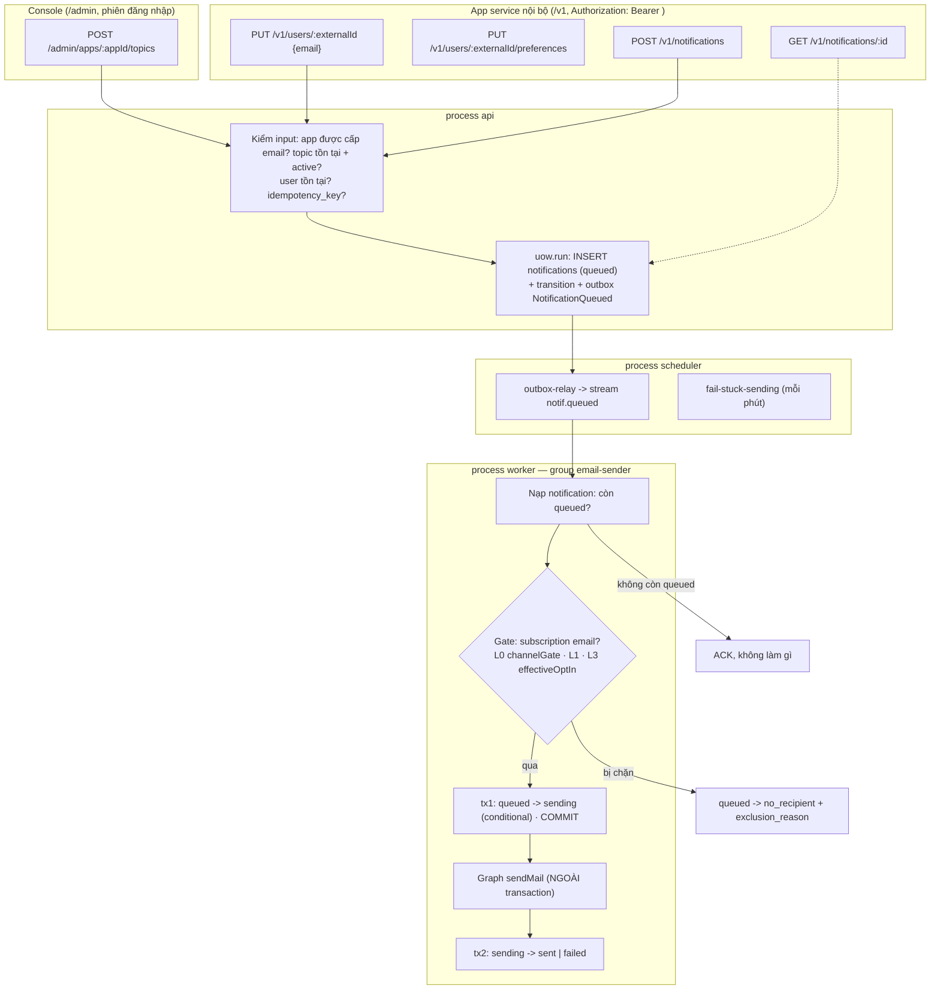

# Kế hoạch triển khai MVP: gửi email trực tiếp qua Microsoft Outlook (Graph)

> Bản sửa 2026-09-19, sau khi đối chiếu với code hiện có. Mọi tên bảng / route / stream / enum dưới đây
> là tên THẬT trong repo — không đặt tên mới khi đã có tên cũ.

## 1. Bối cảnh

Phase 1 đã xong: 3 process `api` / `worker` / `scheduler`, MySQL + outbox, Redis Streams (relay,
consumer group, DLQ, idempotency), 3 module có lát cắt đầy đủ (`tenancy`, `apps`, `audit`).
7 module còn lại mới có domain + schema.

MVP phục vụ **app service nội bộ** (Order, Auth/SSO, Billing, CRM, ERP, Alert...) gửi **email giao
dịch cho từng người**, người nhận bật/tắt được theo topic.

## 2. Quyết định đã chốt

| # | Quyết định | Lý do |
| --- | --- | --- |
| D1 | **Chỉ kênh email.** Subscription luôn `channel = 'email'`, địa chỉ qua `normalizeEmail` (trim + lowercase, giữ `+tag` — ADR-0008). | Phạm vi MVP |
| D2 | **Provider: Microsoft Graph `sendMail`** (Azure App Registration, quyền application `Mail.Send`, client credentials — đã có) + **`MockEmailProvider`** cho dev/test. **Bỏ SMTP.** | Microsoft đang loại bỏ Basic Auth SMTP; hai đường gửi thật là gấp đôi việc test |
| D3 | **At-most-once**: đã giao cho Graph rồi thì KHÔNG BAO GIỜ gửi lại. Không chắc Graph đã nhận hay chưa -> `failed` với lý do `outcome_unknown` để kiểm tay. | Trùng email tệ hơn hiếm khi mất một email |
| D4 | **Chỉ nội dung trực tiếp** `{ subject, html, text? }`. Module `templates` để sau MVP. | Có email thật chạy sớm nhất; templates kéo theo version/publish/luật biến |
| D5 | **Người nhận chỉ theo `external_id`** của app. Không nhận `recipient.email` trần. | Không có user -> không có subscription -> không có L0/L1/L3, không chặn được địa chỉ đã bounce |
| D6 | **Topic do admin tạo** (`/admin`); `/v1/topics` chỉ đọc. | App tự đặt `mandatory = true` là lách được opt-out — tài liệu cấm người gửi tự bỏ qua preference |
| D7 | **Consent kiểm ở worker, ngay trước lúc gửi**, không ở API. API luôn trả 202 (trừ lỗi input). | Consent có thể đổi giữa lúc xếp hàng và lúc gửi; API nhanh; "no_recipient trung tính ở API" (BR-7) |
| D8 | **Dùng lại rule có sẵn**: `channelGate` (L0/L1) và `effectiveOptIn` (L3). `email-gate.ts` chỉ GHÉP hai hàm này cho một người nhận — không viết lại điều kiện nào. | Rule opt-out dễ code ngược nhất — chỉ một bản (ADR-0010) |
| D9 | **Route theo `external_id`**: `/v1/users/:externalId/...`. Mỗi user một email mỗi app. | App service không biết `user_id` / `subscription_id` nội bộ |
| D10 | `sent` = **Microsoft đã nhận** (Graph trả 202), không phải "đã vào hộp thư". | Graph không báo bounce lúc gửi (mục 7) |

## 3. Ngoài phạm vi MVP

`segments` (lọc động 7 bước) · `persons` / identity resolver (gộp danh tính chéo app) · broadcast /
campaign / chia lô 50–200 · `send_approvals` · `templates` · xử lý bounce tự động (đọc NDR) · trang
công khai `/u/:token` cho người nhận tự quản lý preference · hẹn giờ gửi (`scheduled`) · Huỷ / Dừng ·
RBAC theo `admin_app_roles` (đăng nhập admin đã có — ADR-0019 thay §4 của ADR-0015).

Các bảng liên quan vẫn giữ nguyên trong schema, chỉ chưa có code dùng.

## 4. Luồng MVP



## 5. Bề mặt API

| Route | Bề mặt | Việc | Lỗi chính |
| --- | --- | --- | --- |
| `POST /admin/apps/:appId/topics` | admin | Tạo topic `{ key, name, mandatory, defaultMode }` (`draft`) | 409 `TOPIC_KEY_TAKEN` |
| `POST /admin/apps/:appId/topics/:key/activate` · `/suspend` | admin | Đổi trạng thái topic | 409 `INVALID_TRANSITION` |
| `GET /admin/apps/:appId/topics` | admin | Danh sách topic | |
| `GET /v1/topics` | v1 | Topic `active` của app đang gọi (chỉ đọc) | |
| `PUT /v1/users/:externalId` | v1 | Upsert user + email `{ email? }`. Tạo mới -> 201, đã có -> 200; kèm trạng thái email | 409 `EMAIL_TAKEN` (email đã thuộc user khác trong app) |
| `GET /v1/users/:externalId` | v1 | User + email + `status` + `optedOutOptional` | 404 |
| `DELETE /v1/users/:externalId/email` | v1 | User ngắt hẳn email (L0 `unsubscribed`) | 404 |
| `GET /v1/users/:externalId/preferences` | v1 | Mọi topic active + `effectiveOptIn` + `mandatory` + `optedOutOptional` | 404 |
| `PUT /v1/users/:externalId/preferences` | v1 | `{ optedOutOptional?, topics?: { [key]: boolean } }` | 422 `TOPIC_MANDATORY`, 422 `TOPIC_NOT_FOUND` |
| `POST /v1/notifications` | v1 | `{ to: { externalId }, topic, subject, html, text?, idempotencyKey? }` -> **202** `{ id, status: 'queued' }`; trùng `idempotencyKey` -> **200** bản cũ | 422 `CHANNEL_NOT_GRANTED`, `TOPIC_NOT_FOUND`, `TOPIC_NOT_ACTIVE`, `RECIPIENT_NOT_FOUND`, `INVALID_FIELD` |
| `GET /v1/notifications/:id` | v1 | `status`, `exclusionReason`, `error`, mốc thời gian | 404 (kể cả notification của app khác) |

### Bề mặt đọc cho vận hành (`/admin`, CHỈ ĐỌC)

*Bổ sung 2026-09-20 — ĐX-0004. Bảng trên là bề mặt GHI của MVP; nhóm này là bề mặt ĐỌC, mở ra vì
`/admin` không trả lời được hai câu hỏi vận hành thường gặp nhất: "sao người này không nhận được
thư" và "thư đó đã gửi chưa".*

**Nguyên tắc đường dẫn — áp dụng cho MỌI đường trong nhóm này:**

> Đặt dưới `/admin/apps/:appId/*`. Phạm vi theo app nằm trên URL — không phải tham số truy vấn,
> không phải suy ra từ token.

Lý do: bảng `admin_app_roles` (đã có trong schema, vai `super_admin` | `app_admin`, kèm composite
FK chống cấp quyền chéo account — ADR-0011) được thiết kế để phân quyền theo từng app. Hiện
`/admin/*` vẫn dùng một bootstrap token toàn quyền (ADR-0015 §4). Khi làm đăng nhập + RBAC (mục 12
việc 4), vai `app_admin` chỉ cần thêm một lớp kiểm "admin này có quyền trên app này không" —
`appId` đã nằm sẵn trên URL nên cắm vào được ngay, không phải sửa lại bề mặt API lẫn console.

| Route | Bề mặt | Việc | Lỗi chính |
| --- | --- | --- | --- |
| `GET /admin/apps/:appId/users` | admin | Danh sách người nhận của app: `externalId`, email + trạng thái, mốc tạo. Phân trang (`limit`, `offset`), tìm theo `externalId` (`q`) | |
| `GET /admin/apps/:appId/users/:externalId` | admin | Đúng một người nhận, khớp ĐỦ `externalId` (khác `q` của danh sách): cùng dạng một dòng danh sách. Cho trang chi tiết mở thẳng bằng link | 404 |
| `GET /admin/apps/:appId/users/:externalId/preferences` | admin | Cài đặt nhận tin của một người: email + mọi topic `active` kèm `optedIn` và `effectiveOptIn` | 404 |
| `GET /admin/apps/:appId/notifications` | admin | Lịch sử gửi của app, mới nhất trước: trạng thái, topic, `externalId`, kết cục ở người nhận (lý do bị loại / lỗi), các mốc giờ. Phân trang (`limit`, `offset`); lọc khớp đúng theo `status`, `topic`, `externalId`. **Không** kèm địa chỉ email và nội dung thư | 422 (`status` lạ) |

Hai ràng buộc của nhóm:

- **Chỉ đọc.** Admin KHÔNG sửa được lựa chọn topic của người dùng — consent là ý muốn của họ, sửa
  hộ là mất hết ý nghĩa của cổng L0/L1/L3. App service đã có đủ đường ghi qua `/v1` bằng khoá của
  chính nó (`PUT /v1/users/:id/preferences`, `DELETE /v1/users/:id/email`).
- **Dùng lại use case đã có**, không viết lại rule. `GET .../preferences` gọi thẳng
  `GetUserPreferences` của module topics — cùng use case mà `/v1` đang dùng, nên `effectiveOptIn`
  luôn khớp với thứ worker tính lúc gửi (ADR-0010).

Lịch sử gửi thêm 2026-09-21 (ĐX-0002 Việc 2). Không có route chi tiết `/notifications/:id` riêng:
dòng danh sách đã mang đủ mọi trường của `GetNotification` trừ địa chỉ email — route chi tiết chỉ
thêm đúng thứ mà màn này cố ý không hiện.

Quy ước chung giữ nguyên: lỗi là `application/problem+json` có `code`; route chỉ parse -> gọi use
case -> trả DTO; mọi thay đổi ghi event qua outbox (audit tự nhận).

**Luật email khi upsert user** (`PUT /v1/users/:externalId`):
- Email mới -> tạo subscription `active`.
- Đổi sang email khác -> `changeAddress`: địa chỉ mới, xoay `manage_token`; xoá `invalid` (địa chỉ
  mới chưa bounce) nhưng **GIỮ `unsubscribed`** — user đã tự ngắt thì đổi địa chỉ không được bật lại
  nhận thư. (Sửa 2026-09-19: bản đầu ghi `fixAddress` — hàm đó xoá luôn cả `unsubscribed`.)
- Gửi lại đúng email đang `unsubscribed` do user tự ngắt -> bật lại (`resubscribe`, evidence = `app:<appId>`).
- Gửi lại đúng email đang `invalid` (hard bounce / complaint) -> **giữ nguyên `invalid`**, trả trạng
  thái cho app biết. App service không được tự bật lại địa chỉ đã bounce (CLAUDE.md).

## 6. Dữ liệu

Dùng bảng có sẵn: `users`, `subscriptions`, `topics`, `user_topic_preferences`, `notifications`,
`notification_transitions`, `notification_recipients` (1 dòng cho mỗi lần gửi — chứa địa chỉ đã gửi,
`exclusion_reason`, `provider_message_id`, `error`), `outbox`, `processed_messages`.
`users.person_id` để NULL (không resolve danh tính).

**Migration mới `0003`** — `notifications` hiện không có chỗ chứa người nhận và nội dung:

| Cột | Kiểu | Ghi chú |
| --- | --- | --- |
| `target_user_id` | `CHAR(36) NULL` | Người nhận của lần gửi trực tiếp. NULL dành cho gửi theo segment sau này |
| `subject` | `VARCHAR(998) NULL` | 998 = giới hạn độ dài dòng header của RFC 5322 |
| `body_html` | `MEDIUMTEXT NULL` | |
| `body_text` | `MEDIUMTEXT NULL` | |

- `payload` (≤ 2 KB) giữ nguyên nghĩa cũ: dữ liệu biến cho template, KHÔNG chứa nội dung email.
- Body giới hạn **256 KB** — `POST /v1/notifications` cần `bodyLimit` riêng (server hiện để 64 KB).
- Không cần `delivery_batches` (một người nhận = không có lô).
- Lưu ý dung lượng: `notifications` không bao giờ xoá (SM-8) mà giờ chứa body. Sau MVP cân nhắc job
  xoá `body_html`/`body_text` sau N ngày (giữ metadata cho audit).

Trạng thái dùng đúng state machine có sẵn (`notifications/domain/rules/transitions.ts`), không thêm
trạng thái mới:

```
(api)   —accept—> queued
queued  —zero_recipients—> no_recipient     bị gate chặn / không có email
queued  —first_batch_left—> sending         worker "nhận việc" trước khi gọi Graph
sending —all_accepted—> sent                Graph 202
sending —all_failed—> failed                Graph từ chối vĩnh viễn / hết lượt thử / outcome_unknown
```

## 7. Chuyển phát at-most-once

**Graph `sendMail` trả `202 Accepted` rồi xử lý bất đồng bộ.** Vì vậy:
- Lúc gửi chỉ biết được: request bị từ chối (4xx), bị throttle (429), lỗi phía Microsoft (5xx), hoặc lỗi mạng.
- Địa chỉ không tồn tại / hộp thư đầy về SAU dưới dạng thư báo lỗi (NDR) vào hộp thư người gửi ->
  **không** đánh dấu `invalid` lúc gửi. Xử lý bounce là việc sau MVP.

**Các bước của handler `email-sender`:**

1. Nạp notification. Không còn `queued` -> ACK, không làm gì (trùng / đã xử lý).
2. Gate (đọc qua port, không trong transaction dài):
   - không có subscription email -> `no_recipient` / `no_channel`
   - `channelGate(subscription, { topicMandatory })` -> `invalid` / `suppressed` / `opted_out_optional`
   - `effectiveOptIn(topic, preference)` sai -> `opted_out`
   - bị chặn: `uow.run { queued -> no_recipient; ghi notification_recipients kèm lý do; outbox }`.
3. **tx1 — nhận việc:** `uow.run { UPDATE ... SET status='sending' WHERE id=? AND status='queued';
   ghi recipient (pending, địa chỉ tại thời điểm gửi); transition }` -> COMMIT.
   Không cập nhật được dòng nào -> worker khác đã nhận -> ACK.
4. **Gọi Graph NGOÀI transaction**, timeout `EMAIL_SEND_TIMEOUT_MS`:
   - `202` -> kết quả `accepted`.
   - `429` / `503` có `Retry-After`, hoặc lỗi kết nối **trước khi** gửi xong request -> Microsoft chắc
     chắn CHƯA nhận -> thử lại **ngay trong handler** (tối đa 3 lần, tôn trọng `Retry-After`, tổng ≤ 2 phút).
   - `4xx` khác -> `rejected` (vĩnh viễn).
   - Timeout / đứt kết nối **sau khi** đã gửi request -> không biết Microsoft đã nhận chưa ->
     `outcome_unknown`. **Không gửi lại** (D3).
5. **tx2 — ghi kết quả:** `sending -> sent` (lưu `provider_message_id` nếu có) hoặc
   `sending -> failed` (lưu lỗi). ACK.

**Bảng sự cố:**

| Process chết ở | Khi giao lại / sau đó | Kết quả |
| --- | --- | --- |
| trước tx1 | status vẫn `queued` -> chạy lại từ đầu | gửi đúng 1 lần |
| sau tx1, trước / trong lúc gọi Graph | status `sending` -> handler ACK, không gửi | job `fail-stuck-sending` chuyển `failed` / `outcome_unknown` |
| sau khi Graph nhận, trước tx2 | như trên | `failed` / `outcome_unknown` dù thư đã đi — **chấp nhận được với at-most-once**, kiểm tay qua `GET` |

**Job scheduler mới `fail-stuck-sending`** (mỗi phút): notification ở `sending` lâu hơn
`EMAIL_STUCK_SENDING_AFTER_MS` -> `failed` với lỗi `outcome_unknown`. Conditional update theo status,
chạy nhiều bản an toàn.

**Sửa khung `StreamConsumer`** (hạ tầng, nhỏ): hiện handler chạy BÊN TRONG một transaction chung với
`processed_messages`, `uow.run` lồng trong chỉ nhập vào — nên không thể commit tx1 trước khi gọi Graph.
Thêm tuỳ chọn cho consumer: `idempotency: 'handler'` -> khung KHÔNG mở transaction và KHÔNG ghi
`processed_messages`; handler tự lo idempotency bằng conditional update trên status. Consumer cũ
(`audit-writer`) giữ mặc định `'framework'`. Có test riêng cho cả hai chế độ.

**Throttle:** Exchange Online giới hạn tốc độ gửi theo mailbox người gửi (con số cụ thể phải kiểm với
tenant — thường nhắc tới khoảng 30 thư/phút và 10.000 người nhận/ngày). Worker dùng bộ đếm cửa sổ 1 phút trên
Redis (`EMAIL_MAX_PER_MINUTE`) dùng chung giữa mọi bản worker; hết lượt thì chờ trước khi gọi Graph
(chưa qua tx1 thì chưa "nhận việc", không ảnh hưởng at-most-once).

## 8. Kiến trúc: thay đổi cần duyệt

- **ADR-0016 (mới) — MVP email trực tiếp**: ghi D1–D10, at-most-once, migration 0003, tuỳ chọn
  `idempotency: 'handler'`.
- **Sửa ADR-0010**: cho phép thêm `notifications/domain/rules/email-gate.ts` gọi `channelGate` và
  `effectiveOptIn` (chỉ ghép hai hàm có sẵn, không viết lại rule). Cập nhật danh sách cạnh được phép
  trong `test/architecture/dependency-rules.test.ts`.
- **Cổng giữa module** (port + adapter gọi `application` của module kia, như `apps -> tenancy`):
  `notifications` -> `directory` (tra user theo external_id), `subscriptions` (email + trạng thái gate),
  `topics` (topic + preference), `apps` đã có sẵn trong `AppCaller.grantedChannels`.
- `EmailProvider` là **port** của module `delivery` (`application/ports/email-provider.ts`); Graph và
  Mock là adapter ở `delivery/infrastructure/adapters/`. Graph gọi bằng `fetch` có sẵn — không thêm dependency.

## 9. Các giai đoạn

Thứ tự để có email chạy end-to-end (bằng Mock) sớm nhất. Mỗi giai đoạn dừng để review.

### GĐ 0 — Nền ✅ xong 2026-09-19
- ADR-0016, sửa ADR-0010.
- Migration `0003` (cột ở mục 6) + mapper.
- `StreamConsumer`: tuỳ chọn `idempotency: 'handler'` + test.
- `buildHttpServer`: cho phép route đặt `bodyLimit` riêng.
- **Xong khi:** migration chạy trên MySQL thật; test consumer hai chế độ pass; luật kiến trúc pass.

### GĐ 1 — `directory` + `subscriptions` tối thiểu ✅ xong 2026-09-19
- `directory`: `UpsertUser` (theo `app_id` + `external_id`), `FindUserByExternalId`; route
  `PUT /v1/users/:externalId`, `GET /v1/users/:externalId`.
- `subscriptions`: `SetUserEmail` (luật email ở mục 5), `UnsubscribeEmail`, query `FindUserEmail` cho
  module khác. (`SetOptedOutOptional` chuyển sang GĐ 2 — đi cùng route preferences, tránh viết use case
  chưa ai gọi.)
- Mức cô lập chuyển sang READ COMMITTED (ADR-0017) — test race của GĐ 1 lộ lỗi snapshot của RR.
- Upsert user + email trong CÙNG một `uow.run` (directory gọi subscriptions qua port).
- **Test:** email trùng user khác -> 409; email `invalid` không bật lại được; `unsubscribed` bật lại được;
  đổi email -> `manage_token` đổi; chuẩn hoá email (hoa thường, khoảng trắng, giữ `+tag`).

### GĐ 2 — `topics` + preferences ✅ xong 2026-09-19
- Admin: tạo / kích hoạt / đình chỉ topic. `GET /v1/topics`.
- `SetUserPreferences` (topic thường + `optedOutOptional`), `GetUserPreferences` (trả `effectiveOptIn`).
- Route preferences thuộc module `topics` (dù path nằm dưới `/v1/users`); topics hỏi directory (tra user)
  và subscriptions (cờ L1) qua port — phụ thuộc một chiều `topics -> directory -> subscriptions`.
- `PUT` preferences kiểm TẤT CẢ trước khi ghi: một topic sai thì không lưu gì. `effectiveOptIn` chỉ là
  lớp L3; L0/L1 trả riêng ở `email` và xét lúc gửi.
- **Test:** tắt topic mandatory -> 422 `TOPIC_MANDATORY`; topic `opt_in` chưa có preference -> không
  nhận; topic của app khác -> 404.

### GĐ 3 — `notifications` + worker gửi (Mock) ✅ xong 2026-09-19
- `AcceptEmailNotification` (API): kiểm input, idempotency (trùng key -> 200 bản cũ), INSERT `queued`
  + outbox `NotificationQueued` (đã route sang `notif.queued`).
- `email-gate.ts` (domain) + `DeliverEmailNotification` (worker, các bước ở mục 7) + port `EmailProvider`
  + `MockEmailProvider` (ghi log, cấu hình được để giả lập 202 / 429 / 4xx / timeout).
- Consumer group `email-sender` trên `notif.queued` (`idempotency: 'handler'`); job `fail-stuck-sending`.
- `GET /v1/notifications/:id`.
- Thêm migration `0004`: index `(status, sending_at)` — job fail-stuck-sending chạy mỗi phút trên bảng
  không bao giờ xoá dòng.
- Test race "nhiều worker cùng một notification" gọi đúng handler 5 lần qua barrier; đã thăm dò: bỏ
  `WHERE status = 'queued'` là test đỏ (provider bị gọi nhiều lần).
- Test tiêm `MockEmailProvider` qua `buildApplication(container, { emailProvider })`.
- **Test:** đủ các nhánh gate (mandatory vượt L1+L3 nhưng không vượt L0); 429 rồi thành công -> `sent`
  đúng 1 lần gửi; timeout sau khi gửi -> `failed/outcome_unknown` và **không** gửi lần hai; giao lại
  message khi đang `sending` -> không gửi; hai worker cùng nhận một message -> đúng 1 lần gửi (race).

### GĐ 4 — Graph provider ✅ xong 2026-09-19
- ADR-0018. `GraphEmailProvider`: token client credentials (cache, làm mới trước hết hạn 5 phút, một
  request token cho nhiều lần gửi đồng thời), `POST /v1.0/users/{EMAIL_SENDER_ADDRESS}/sendMail`, header
  `X-EWS-Notification-Id` + `client-request-id`. Phân loại kết quả theo bảng ở ADR-0018 D2.
- Giới hạn `EMAIL_MAX_PER_MINUTE`: cửa sổ cố định 1 phút trên Redis (`shared/rate-limit`), dùng chung mọi
  worker; chờ lượt SAU gate, TRƯỚC tx1 (lý do ở ADR-0018 D3).
- `loadEnv` fail-fast khi `graph` thiếu biến; compose truyền biến email/Graph qua `${VAR:-}`.
- `npm run email:test -- <địa chỉ>`: gửi một thư thử thật qua provider đang cấu hình.
- **Test:** unit `graph-email-provider.test.ts` (format request, cache token, 202 / 429 / 503 / 401 /
  4xx / 5xx / lỗi mạng / timeout / token bị từ chối, bằng `fetch` giả); integration `rate-limit.test.ts`
  (20 lượt đồng thời, trần 5 -> đúng 5 qua; sang phút mới; TTL key).
- **Gửi thử thật (thủ công):** trong `.env` đặt `EMAIL_PROVIDER=graph`, `EMAIL_SENDER_ADDRESS` và 3 biến
  `GRAPH_*` -> `npm run email:test -- ban@company.com` -> kết quả `accepted` là cấu hình đúng; kiểm hộp thư.

## 10. Cấu hình (.env)

```env
EMAIL_PROVIDER=mock                    # mock | graph
EMAIL_SENDER_ADDRESS=noreply@company.com   # mailbox gửi (phải tồn tại trong tenant)
EMAIL_MAX_PER_MINUTE=30                # throttle chung mọi worker — chỉnh theo giới hạn tenant
EMAIL_SEND_TIMEOUT_MS=15000
EMAIL_STUCK_SENDING_AFTER_MS=600000    # quá 10 phút ở `sending` -> failed/outcome_unknown

# Bắt buộc khi EMAIL_PROVIDER=graph (Azure App Registration, quyền application Mail.Send)
GRAPH_TENANT_ID=
GRAPH_CLIENT_ID=
GRAPH_CLIENT_SECRET=
```

`loadEnv` kiểm: `EMAIL_PROVIDER=graph` mà thiếu biến `GRAPH_*` -> dừng khởi động (fail-fast).
Nên giới hạn App Registration chỉ gửi được từ đúng mailbox này (Application Access Policy của Exchange)
— quyền `Mail.Send` application mặc định gửi được thay MỌI mailbox trong tenant.

## 11. Kiểm chứng

- `npm run typecheck` · `npm test` (unit + luật kiến trúc) · `npm run test:integration`.
- Unit: `email-gate` (bảng tổ hợp L0/L1/L3 × mandatory), phân loại kết quả Graph, luật email khi upsert.
- Integration (MySQL + Redis thật, `MockEmailProvider`):
  1. Admin tạo topic `order_updates` và kích hoạt.
  2. `PUT /v1/users/emp_01 { email: "nhanvien@company.com" }`.
  3. `POST /v1/notifications { to: { externalId: "emp_01" }, topic: "order_updates", ... }` -> 202.
  4. Scheduler relay -> worker `email-sender` -> Mock nhận đúng 1 thư.
  5. `GET /v1/notifications/:id` -> `status: "sent"`; `/admin/audit` có đủ event.
  6. User tắt `order_updates` -> gửi lại -> `no_recipient` / `opted_out`, Mock không nhận thư.
- Docker: `EMAIL_PROVIDER=mock docker compose up --build` chạy lại kịch bản trên bằng HTTP.

## 12. Sau MVP (thứ tự gợi ý)

1. Xử lý bounce: đọc NDR từ hộp thư người gửi -> subscription `invalid` (`hard_bounce`).
2. `templates` (cú pháp `{{ payload.x }}` / `{{ user.tags.x }}` đã chốt trong `template-variables.ts`) — ADR-0020.
   GĐ 1 xong: admin soạn / xuất bản dưới `/admin/apps/:appId/templates`. GĐ 2 xong: gửi bằng
   `templateId` + `payload` qua `/v1/notifications`. GĐ 3 xong: màn Templates của console đã đấu API.
3. Link "Quản lý thông báo" + trang `/u/:token` (bắt buộc khi gửi ra ngoài công ty).
4. ~~Đăng nhập admin thay `ADMIN_TOKEN`~~ — xong (ADR-0019: phiên mờ trong `admin_sessions`, CLI
   `admin-cli` tạo admin đầu tiên). Còn lại của việc này: **RBAC** theo `admin_app_roles`
   (`app_admin` chỉ chạm app được cấp), giới hạn số lần đăng nhập sai, và "đăng xuất mọi thiết bị"
   trên giao diện.
5. Quota theo app (`rate_limit_per_minute`, 429 ở API).
6. Segments / broadcast / identity resolver khi có nhu cầu gửi hàng loạt.
